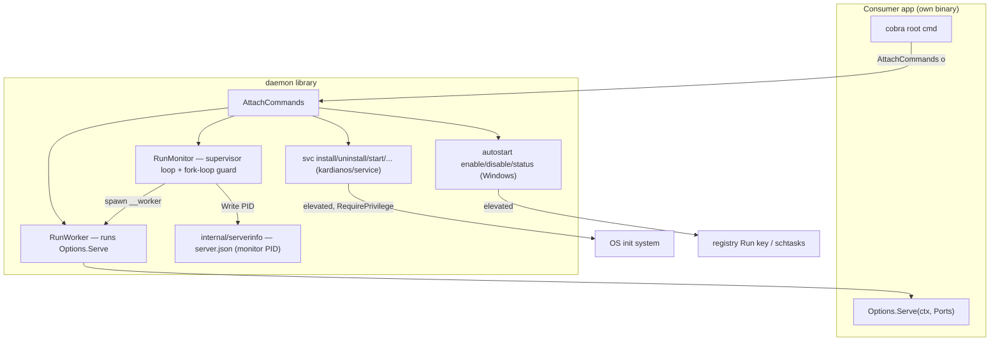
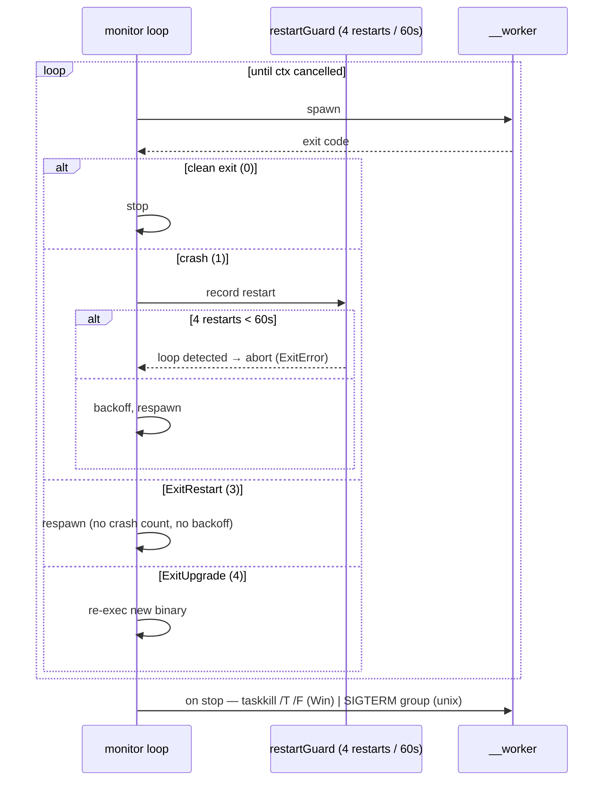

# Architecture
<!-- rev:002 -->

Current-state architecture of `github.com/inovacc/daemon` (a pure library; package `daemon`
at the module root — see ADR-0002). For the original design rationale and the state machine,
see [SERVICE_LIFECYCLE.md](SERVICE_LIFECYCLE.md); for Windows autostart, [AUTOSTART.md](AUTOSTART.md).

## System overview



## Detached start (spawn chain — 3 roles)

```mermaid
sequenceDiagram
    participant U as user: service start
    participant D as daemonize (Start)
    participant M as __monitor
    participant W as __worker
    participant S as serverinfo
    U->>D: Start(o)
    D->>D: env-guard check; IsRunning?
    alt already running
        D-->>U: ErrAlreadyRunning (pid)
    else
        D->>M: spawn detached (buildMonitorArgs — NO worker role, NO ports)
        M->>S: Write(monitor PID)
        M->>W: spawn __worker --port N --grpc-port N (buildWorkerArgs)
        W->>W: Options.Serve(ctx, Ports)
        D->>S: poll IsRunning up to healthWaitTimeout (5s)
        alt serverinfo observed
            D-->>U: started: pid=N
        else timeout
            D-->>U: pid + ErrHealthCheckTimeout (unconfirmed)
        end
    end
```

## Supervisor lifecycle



## Source layout

| File(s) | Responsibility |
|---------|----------------|
| `cobra.go` | `AttachCommands`, `RunWorker`; wires `service`, `svc`, `autostart` + hidden `__monitor`/`__worker` |
| `options.go` | `Options`, `Ports`, `withDefaults` (derives `portsExplicit`) |
| `args.go` | `buildMonitorArgs` (no worker role/ports) / `buildWorkerArgs` (always ports) |
| `daemonize.go` | `Start`/`Stop`; detached spawn + health wait (`ErrHealthCheckTimeout`) |
| `monitor.go`, `restartguard.go` | supervisor loop + sliding-window fork-loop guard |
| `svc.go` | `svc` group over kardianos/service; `--autostart` combined trigger |
| `autostart.go`, `autostart_windows.go`, `autostart_unix.go` | Windows launch-at-logon (unix = unsupported stub) |
| `spawn_*.go`, `reexec_*.go`, `stop_*.go` | platform detach / re-exec / stop (build-tagged) |
| `exitstatus.go`, `privilege*.go` | exit-code protocol; `RequirePrivilege` → exit 5 |
| `internal/serverinfo/` | monitor-PID `server.json` (write/read/IsRunning + stale self-heal) |
