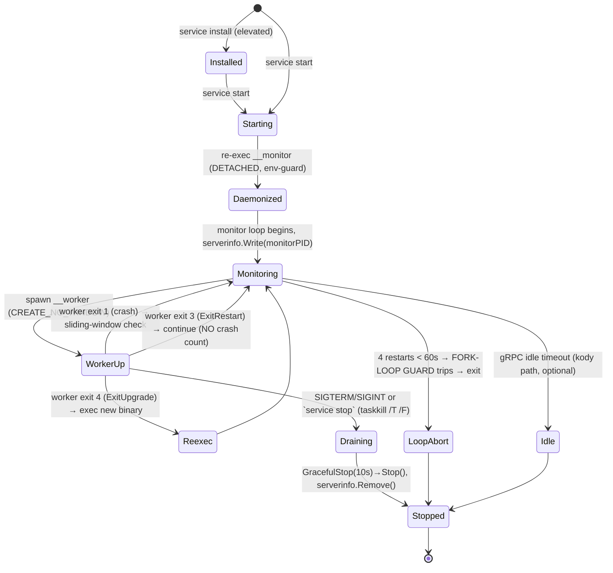

# Daemon / Service Layer — Reuse Evaluation & Concrete Lifecycle

Status: design draft · Target: `github.com/inovacc/daemon` (reusable module)

## 1. Cross-project audit (what to harvest)

Scanned `acer/projects/*` for daemon/service-layer markers (idle tracker, serverinfo,
inner-process, restart loop, platform svc, signal handling). Two production-grade
references dominate; the rest are non-daemon or thin.

| Project | Role | What to extract | Maturity |
|---------|------|-----------------|----------|
| **weaver** (`dyammarcano/weaver`) | **Canonical supervisor** | monitor restart loop, `buildServeArgs`, exit-code protocol, `internal/serverinfo`, platform `server_{windows,unix,darwin,systemd}.go`, taskkill `/T /F` stop, sudo/UAC elevation | High — matches supervisor-pattern skill almost verbatim (`restartCounts=4`, `restartLoopThreshold=60s`) |
| **kody** (`inovacc/kody`) | **Canonical gRPC thin-client** | `internal/server/grpc/{server.go,idle.go}` (IdleTracker, graceful stop), `cmd/{server,service}.go`, discovery/auto-start | High — cited predecessor of thin-client-daemon skill |
| **glix** (`inovacc/glix`) | Windows service mgr | `internal/service/manager_windows.go`, `cmd/service_run.go` (SCM specifics) | Medium |
| code_analyzer, gops, drawing, claude-status, convenia | Not daemons | matches were git/exec/obfuscation false-positives | n/a |

**Conclusion:** the reusable `daemon` module = **weaver's supervisor layer** ⊕ **kody's gRPC
daemon layer**, unified under one option-driven API. weaver and kody currently duplicate
`serverinfo`, exit codes, platform detach, and stop logic — that duplication is the
extraction target.

## 2. Concrete service lifecycle (state machine)



## 3. Inner-process / child-process model via private `__command`

Convention: **user-facing verbs are public; supervisor-internal roles are hidden Cobra
commands prefixed `__`** (double underscore). They never appear in `--help`, and the
role + ports are visible in `ps`/Task Manager (the reason weaver/the skill avoid hiding
ports as same-command flags).

### Command tree
```
<binary> service                 # foreground monitor+worker (Type=simple / debug)
<binary> service start           # daemonize → re-exec __monitor detached
<binary> service stop            # read serverinfo → taskkill /T /F (Win) | SIGINT (unix)
<binary> service status          # read serverinfo, verify PID + name, show uptime
<binary> service install|uninstall   # SCM / systemd / launchd (elevated)
<binary> __monitor   [flags]     # HIDDEN: supervisor restart loop (spawned by daemonize)
<binary> __worker --port N --grpc-port N [flags]   # HIDDEN: the inner worker process
```

### Spawn chain (3 hops, each hop a distinct role)
```
user      : <binary> service start
daemonize : <binary> __monitor            (buildMonitorArgs → NO __worker, NO ports)
monitor   : <binary> __worker --port 9500 --grpc-port 9501   (buildWorkerArgs → always ports)
```

### Cobra wiring (sketch)
```go
// __monitor — hidden supervisor entry
var monitorCmd = &cobra.Command{Use: "__monitor", Hidden: true,
    RunE: func(*cobra.Command, []string) error { return daemon.RunMonitor(opts) }}

// __worker — hidden inner-process entry; ports ALWAYS present for ps visibility
var workerCmd = &cobra.Command{Use: "__worker", Hidden: true,
    RunE: func(*cobra.Command, []string) error { return daemon.RunWorker(opts) }}
```

### Role-selection rules (the bug-prone seams — bake into the module, not the consumer)
- `daemonize()` MUST build `__monitor` args (`buildMonitorArgs`), never `__worker`.
  If it spawns `__worker`, the daemon skips the monitor → `serverinfo.Write()` never runs
  → `stop`/`status` silently break. (weaver/skill lesson.)
- `serverinfo` stores the **monitor PID**, so `stop` kills the tree from the root.
- `__worker` MUST skip the singleton `IsRunning()` check — the monitor already wrote
  serverinfo with its own PID; otherwise the worker sees "already running" and exits/respawns.
- Heavy init (DB, gRPC service registration) deferred to `initServices()` inside the worker
  AFTER port bind — never in `New()` — to avoid `SQLITE_BUSY` from racing instances.

## 4. Fork/spawn loop-hell guard (mandatory — see memory)

Enforced inside the module's monitor loop so no consumer can forget it:
- Sliding window: `var restarts [4]time.Time`; if 4 restarts land within `60s` → abort, exit `ExitError`.
- Exponential backoff: `delay = min(1s * 2^attempt, 60s)`; reset after sustained healthy run.
- `ExitRestart` (3) uses `continue` — bypasses crash counter AND backoff (API-driven restarts must not trip the guard).
- Self-spawn env guard: gate daemonization behind `<APP>_DAEMON_CHILD`; strip legacy
  supervisor env prefixes from child env to prevent recursive re-spawn / double-signal.
- TOCTOU: re-acquire the single-instance lock inside `startDetached()` immediately before
  spawn; post-spawn wait loop verifies **health**, not just serverinfo existence.

## 5. Proposed reusable module layout (`github.com/inovacc/daemon`)

```
daemon/
  daemon.go        # Options (WithPort, WithIdleTimeout, WithDataDir, WithServiceName...) + RunMonitor/RunWorker
  monitor.go       # restart loop + sliding-window guard + signal forwarding + arg builders
  worker.go        # inner-process scaffold: bind → serverinfo.Write → initServices → serve
  exitstatus.go    # ExitSuccess=0 ExitError=1 ExitRestart=3 ExitUpgrade=4
  serverinfo/      # PID file read/write/IsRunning (from weaver/kody — dedupe)
  datadir/         # %LOCALAPPDATA% / ~/.local/share / ~/Library resolution
  grpcd/           # kody's gRPC server + IdleTracker + discovery/auto-start (thin-client path)
  proc_windows.go  # DETACHED_PROCESS|CREATE_NEW_PROCESS_GROUP+HideWindow (daemon); CREATE_NO_WINDOW (worker)
  proc_unix.go     # Setsid / Setpgid
  stop_windows.go  # taskkill /PID /T /F        stop_unix.go # SIGINT
  cobra.go         # AttachCommands(root): wires `service` + hidden `__monitor`/`__worker`
```

Consumer integration is one call: `daemon.AttachCommands(rootCmd, daemon.Options{...})`
then implement the worker body via `daemon.Options.Serve(ctx, ports) error`.

## 6. Next steps
1. Extract weaver `serverinfo` + exit codes + platform files → module (lowest-risk, pure dedupe).
2. Lift kody `grpcd` (server+idle+discovery) → `daemon/grpcd`.
3. Implement `cobra.go` `__monitor`/`__worker` wiring + the loop guard (§4).
4. Port weaver and kody to consume the module; keep old code behind a deprecation date.
